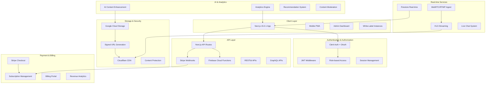

# Design Document

## Overview

This document outlines the technical design for StreamVault, a modern, aesthetic live streaming platform with subscription-based monetization and enterprise-grade features. The platform leverages Next.js 15.0.1 with App Router, TypeScript, and a comprehensive tech stack to deliver high-performance live streaming, secure VOD management with signed URLs, AI-powered content enhancement, and advanced subscription services.

The architecture follows microservices-ready patterns with serverless functions, real-time data synchronization, global CDN delivery, and enterprise security measures to ensure scalability, content protection, and optimal user experience across all devices. The platform supports white-label customization, comprehensive APIs, and progressive web app capabilities for maximum flexibility and reach.

**Repository Integration:** https://github.com/code-craka/streamvault.git with automated CI/CD pipeline and feature branch workflow.

## Architecture

### High-Level Architecture



### Technology Stack

**Frontend Framework**

- Next.js 15.0.1 with App Router (no src folder)
- React 19 with Server Components and Streaming
- TypeScript for type safety with 100% coverage
- Tailwind CSS v4 for styling with white-label theming
- shadcn/ui for component library
- Framer Motion for animations
- pnpm for package management
- Progressive Web App (PWA) capabilities

**State Management**

- Zustand for client-side state
- React Query (TanStack Query) for server state
- Firestore real-time listeners for live data
- Cross-device synchronization

**Authentication & Security**

- Clerk for authentication with OAuth providers (Google, GitHub, Discord)
- JWT validation and session management
- Middleware-based route protection with Zod validation
- Role-based access control (viewer/streamer/admin)
- Enterprise-grade security with DDoS protection
- GDPR/CCPA compliance implementation

**Backend Services**

- Firebase Firestore for real-time database
- Firebase Cloud Functions for serverless logic
- Google Cloud Storage (`gs://streamvault-videos`) with signed URLs
- Service Account: `ghstreamvault@shining-courage-465501-i8.iam.gserviceaccount.com`
- Cloudflare CDN for global content delivery with edge computing

**Streaming Infrastructure**

- RTMP ingest endpoints for live streams
- HLS transcoding and adaptive bitrate streaming (480p-4K)
- WebRTC for low-latency streaming
- Custom HLS.js player with auto-quality adjustment
- Sub-3-second latency optimization

**AI & Content Enhancement**

- AI-powered content moderation and copyright detection
- Automatic thumbnail, title, and description generation
- Multi-language transcription and subtitle generation
- Personalized recommendation engine
- Content optimization suggestions

**Payment Processing**

- Stripe Checkout for subscription management
- Stripe Billing Portal for customer self-service
- Webhook handling for real-time updates
- Enhanced tiered subscription model (Basic/Premium/Pro)
- Revenue analytics and tax documentation

**API Ecosystem**

- RESTful APIs with comprehensive documentation
- GraphQL APIs for flexible data querying
- Webhook system for third-party integrations
- Rate limiting and authentication for external access
- White-label API customization

## Components and Interfaces

### Core Components

#### 1. Authentication System

**Clerk Integration**

```typescript
// middleware.ts
import { clerkMiddleware, createRouteMatcher } from '@clerk/nextjs/server'

const isProtectedRoute = createRouteMatcher([
  '/dashboard(.*)',
  '/stream(.*)',
  '/library(.*)',
])

export default clerkMiddleware((auth, req) => {
  if (isProtectedRoute(req)) auth().protect()
})

// User role management
interface UserMetadata {
  role: 'viewer' | 'streamer' | 'admin'
  subscriptionTier: 'basic' | 'premium' | 'pro' | null
  subscriptionStatus: 'active' | 'canceled' | 'past_due' | null
}
```

**Role-based Access Control**

```typescript
// lib/auth.ts
export const checkUserRole = (user: User, requiredRole: UserRole): boolean => {
  const userRole = user.publicMetadata.role as UserRole
  const roleHierarchy = { viewer: 0, streamer: 1, admin: 2 }
  return roleHierarchy[userRole] >= roleHierarchy[requiredRole]
}

export const checkSubscriptionAccess = (
  user: User,
  requiredTier: SubscriptionTier
): boolean => {
  const userTier = user.publicMetadata.subscriptionTier
  if (!userTier) return requiredTier === 'basic'

  const tierHierarchy = { basic: 0, premium: 1, pro: 2 }
  return tierHierarchy[userTier] >= tierHierarchy[requiredTier]
}
```

#### 2. Live Streaming Infrastructure

**Stream Management Service**

```typescript
// lib/streaming/stream-manager.ts
export class StreamManager {
  async createStream(userId: string): Promise<StreamConfig> {
    const streamKey = generateSecureStreamKey()
    const rtmpUrl = `rtmp://ingest.${process.env.STREAMING_DOMAIN}/live`

    const streamConfig = {
      id: generateId(),
      userId,
      streamKey,
      rtmpUrl,
      hlsUrl: `https://cdn.${process.env.STREAMING_DOMAIN}/hls/${streamKey}/index.m3u8`,
      status: 'inactive',
      createdAt: new Date(),
    }

    await this.saveStreamConfig(streamConfig)
    return streamConfig
  }

  async startStream(streamId: string): Promise<void> {
    // Initialize transcoding pipeline
    await this.initializeTranscoding(streamId)

    // Update stream status
    await this.updateStreamStatus(streamId, 'active')

    // Notify subscribers
    await this.notifyStreamStart(streamId)
  }
}
```

**HLS Player Component**

```typescript
// components/player/hls-player.tsx
'use client'

import { useEffect, useRef, useState } from 'react'
import Hls from 'hls.js'

interface HLSPlayerProps {
  src: string
  isLive?: boolean
  onError?: (error: any) => void
  onLoadedData?: () => void
}

export function HLSPlayer({ src, isLive, onError, onLoadedData }: HLSPlayerProps) {
  const videoRef = useRef<HTMLVideoElement>(null)
  const hlsRef = useRef<Hls | null>(null)
  const [isLoading, setIsLoading] = useState(true)

  useEffect(() => {
    if (!videoRef.current) return

    if (Hls.isSupported()) {
      const hls = new Hls({
        enableWorker: true,
        lowLatencyMode: isLive,
        backBufferLength: isLive ? 4 : 30
      })

      hls.loadSource(src)
      hls.attachMedia(videoRef.current)

      hls.on(Hls.Events.MANIFEST_PARSED, () => {
        setIsLoading(false)
        onLoadedData?.()
      })

      hls.on(Hls.Events.ERROR, (event, data) => {
        if (data.fatal) {
          onError?.(data)
        }
      })

      hlsRef.current = hls
    }

    return () => {
      hlsRef.current?.destroy()
    }
  }, [src, isLive])

  return (
    <div className="relative aspect-video bg-black rounded-lg overflow-hidden">
      <video
        ref={videoRef}
        className="w-full h-full"
        controls
        playsInline
        muted
      />
      {isLoading && (
        <div className="absolute inset-0 flex items-center justify-center">
          <div className="animate-spin rounded-full h-8 w-8 border-b-2 border-white" />
        </div>
      )}
    </div>
  )
}
```

#### 3. Enhanced Real-time Chat System with AI Moderation

**Advanced Chat Component with Moderation**

```typescript
// components/chat/enhanced-live-chat.tsx
'use client'

import { useEffect, useState } from 'react'
import { collection, query, orderBy, limit, onSnapshot, addDoc, deleteDoc, doc } from 'firebase/firestore'
import { useUser } from '@clerk/nextjs'
import { db } from '@/lib/firebase'
import { moderateContent } from '@/lib/ai/content-moderation'
import { CustomEmote } from '@/components/chat/custom-emote'

interface ChatMessage {
  id: string
  userId: string
  username: string
  message: string
  timestamp: Date
  isStreamer?: boolean
  isPremium?: boolean
  isDeleted?: boolean
  moderatedBy?: string
  emotes?: string[]
  priority?: 'normal' | 'premium' | 'streamer'
}

interface ModerationTools {
  canDelete: boolean
  canTimeout: boolean
  canBan: boolean
}

export function EnhancedLiveChat({ streamId }: { streamId: string }) {
  const { user } = useUser()
  const [messages, setMessages] = useState<ChatMessage[]>([])
  const [newMessage, setNewMessage] = useState('')
  const [isRateLimited, setIsRateLimited] = useState(false)
  const [moderationTools, setModerationTools] = useState<ModerationTools>({
    canDelete: false,
    canTimeout: false,
    canBan: false
  })

  // Rate limiting based on subscription tier
  const getRateLimit = () => {
    const tier = user?.publicMetadata.subscriptionTier as string
    switch (tier) {
      case 'pro': return 5000 // 5 messages per second
      case 'premium': return 3000 // 3 messages per second
      default: return 1000 // 1 message per second
    }
  }

  useEffect(() => {
    // Set moderation permissions
    const userRole = user?.publicMetadata.role as string
    setModerationTools({
      canDelete: ['admin', 'streamer'].includes(userRole),
      canTimeout: ['admin', 'streamer'].includes(userRole),
      canBan: userRole === 'admin'
    })

    const messagesRef = collection(db, 'streams', streamId, 'messages')
    const q = query(messagesRef, orderBy('timestamp', 'desc'), limit(100))

    const unsubscribe = onSnapshot(q, (snapshot) => {
      const newMessages = snapshot.docs.map(doc => ({
        id: doc.id,
        ...doc.data(),
        timestamp: doc.data().timestamp?.toDate()
      })) as ChatMessage[]

      setMessages(newMessages.reverse())
    })

    return unsubscribe
  }, [streamId, user])

  const sendMessage = async () => {
    if (!newMessage.trim() || !user || isRateLimited) return

    // AI content moderation
    const moderationResult = await moderateContent(newMessage)
    if (!moderationResult.approved) {
      alert('Message blocked: ' + moderationResult.reason)
      return
    }

    // Rate limiting
    setIsRateLimited(true)
    setTimeout(() => setIsRateLimited(false), getRateLimit())

    const messagesRef = collection(db, 'streams', streamId, 'messages')
    const userTier = user.publicMetadata.subscriptionTier as string

    await addDoc(messagesRef, {
      userId: user.id,
      username: user.username || user.firstName || 'Anonymous',
      message: newMessage.trim(),
      timestamp: new Date(),
      isStreamer: user.publicMetadata.role === 'streamer',
      isPremium: ['premium', 'pro'].includes(userTier),
      priority: user.publicMetadata.role === 'streamer' ? 'streamer' :
               ['premium', 'pro'].includes(userTier) ? 'premium' : 'normal',
      emotes: moderationResult.detectedEmotes || []
    })

    setNewMessage('')
  }

  const deleteMessage = async (messageId: string) => {
    if (!moderationTools.canDelete) return

    await deleteDoc(doc(db, 'streams', streamId, 'messages', messageId))
  }

  return (
    <div className="flex flex-col h-96 bg-gray-900 rounded-lg">
      <div className="flex-1 overflow-y-auto p-4 space-y-2">
        {messages.map((message) => (
          <div key={message.id} className={`flex items-start space-x-2 ${
            message.priority === 'streamer' ? 'bg-red-900/20 p-2 rounded' :
            message.priority === 'premium' ? 'bg-yellow-900/20 p-2 rounded' : ''
          }`}>
            <span className={`font-semibold ${
              message.isStreamer ? 'text-red-400' :
              message.isPremium ? 'text-yellow-400' : 'text-gray-300'
            }`}>
              {message.username}:
            </span>
            <span className="text-white flex-1">
              {message.message}
              {message.emotes?.map((emote, idx) => (
                <CustomEmote key={idx} emoteId={emote} />
              ))}
            </span>
            {moderationTools.canDelete && (
              <button
                onClick={() => deleteMessage(message.id)}
                className="text-red-400 hover:text-red-300 text-sm"
              >
                Delete
              </button>
            )}
          </div>
        ))}
      </div>

      <div className="p-4 border-t border-gray-700">
        <div className="flex space-x-2">
          <input
            type="text"
            value={newMessage}
            onChange={(e) => setNewMessage(e.target.value)}
            onKeyPress={(e) => e.key === 'Enter' && sendMessage()}
            placeholder={isRateLimited ? 'Rate limited...' : 'Type a message...'}
            disabled={isRateLimited}
            className="flex-1 bg-gray-800 text-white rounded px-3 py-2 disabled:opacity-50"
          />
          <button
            onClick={sendMessage}
            disabled={isRateLimited}
            className="bg-blue-600 text-white px-4 py-2 rounded hover:bg-blue-700 disabled:opacity-50"
          >
            Send
          </button>
        </div>
      </div>
    </div>
  )
}
```

#### 4. Secure VOD Management with Signed URLs

**Signed URL Service for Content Protection**

```typescript
// lib/storage/signed-url-service.ts
import { Storage } from '@google-cloud/storage'

const storage = new Storage({
  projectId: process.env.GCP_PROJECT_ID,
  keyFilename: process.env.GOOGLE_APPLICATION_CREDENTIALS,
})

const bucket = storage.bucket(process.env.GCS_BUCKET_NAME!)

export class SignedURLService {
  async generateSignedURL(
    videoId: string,
    userId: string,
    requiredTier: SubscriptionTier
  ): Promise<string> {
    // Validate user subscription
    const user = await clerkClient.users.getUser(userId)
    const userTier = user.publicMetadata.subscriptionTier as SubscriptionTier

    if (!this.hasAccess(userTier, requiredTier)) {
      throw new APIError(
        'Insufficient subscription tier',
        403,
        'SUBSCRIPTION_REQUIRED'
      )
    }

    const fileName = `videos/${videoId}.mp4`
    const file = bucket.file(fileName)

    // Generate signed URL with 15-minute expiration
    const [signedUrl] = await file.getSignedUrl({
      version: 'v4',
      action: 'read',
      expires: Date.now() + 15 * 60 * 1000, // 15 minutes
      responseDisposition: 'inline',
      responseType: 'video/mp4',
    })

    // Log access for analytics
    await this.logVideoAccess(videoId, userId, userTier)

    return signedUrl
  }

  async refreshSignedURL(videoId: string, userId: string): Promise<string> {
    // Validate ongoing playback session
    const session = await this.getPlaybackSession(videoId, userId)
    if (!session || session.expired) {
      throw new APIError('Playback session expired', 401, 'SESSION_EXPIRED')
    }

    return this.generateSignedURL(videoId, userId, session.requiredTier)
  }

  private hasAccess(
    userTier: SubscriptionTier | null,
    requiredTier: SubscriptionTier
  ): boolean {
    if (!userTier) return requiredTier === 'basic'

    const tierHierarchy = { basic: 0, premium: 1, pro: 2 }
    return tierHierarchy[userTier] >= tierHierarchy[requiredTier]
  }
}
```

**VOD Player with Automatic URL Refresh**

```typescript
// components/player/secure-vod-player.tsx
'use client'

import { useEffect, useRef, useState } from 'react'
import { useUser } from '@clerk/nextjs'

interface SecureVODPlayerProps {
  videoId: string
  requiredTier: SubscriptionTier
  onError?: (error: any) => void
}

export function SecureVODPlayer({ videoId, requiredTier, onError }: SecureVODPlayerProps) {
  const { user } = useUser()
  const videoRef = useRef<HTMLVideoElement>(null)
  const [videoUrl, setVideoUrl] = useState<string>('')
  const [isLoading, setIsLoading] = useState(true)
  const refreshIntervalRef = useRef<NodeJS.Timeout>()

  const fetchSignedURL = async () => {
    try {
      const response = await fetch(`/api/videos/${videoId}/signed-url`, {
        headers: {
          'Authorization': `Bearer ${await user?.getToken()}`
        }
      })

      if (!response.ok) {
        throw new Error('Failed to get video URL')
      }

      const { signedUrl } = await response.json()
      setVideoUrl(signedUrl)
      setIsLoading(false)

      // Set up automatic refresh every 12 minutes (before 15-minute expiration)
      if (refreshIntervalRef.current) {
        clearInterval(refreshIntervalRef.current)
      }

      refreshIntervalRef.current = setInterval(async () => {
        try {
          const refreshResponse = await fetch(`/api/videos/${videoId}/refresh-url`, {
            headers: {
              'Authorization': `Bearer ${await user?.getToken()}`
            }
          })

          if (refreshResponse.ok) {
            const { signedUrl: newUrl } = await refreshResponse.json()
            setVideoUrl(newUrl)
          }
        } catch (error) {
          console.error('Failed to refresh video URL:', error)
        }
      }, 12 * 60 * 1000) // 12 minutes

    } catch (error) {
      onError?.(error)
      setIsLoading(false)
    }
  }

  useEffect(() => {
    if (user) {
      fetchSignedURL()
    }

    return () => {
      if (refreshIntervalRef.current) {
        clearInterval(refreshIntervalRef.current)
      }
    }
  }, [user, videoId])

  if (isLoading) {
    return (
      <div className="aspect-video bg-black rounded-lg flex items-center justify-center">
        <div className="animate-spin rounded-full h-8 w-8 border-b-2 border-white" />
      </div>
    )
  }

  return (
    <div className="aspect-video bg-black rounded-lg overflow-hidden">
      <video
        ref={videoRef}
        src={videoUrl}
        className="w-full h-full"
        controls
        playsInline
      />
    </div>
  )
}
```

#### 5. AI-Powered Content Enhancement

**AI Content Processing Service**

```typescript
// lib/ai/content-enhancement.ts
export class AIContentEnhancement {
  async processUploadedVideo(
    videoId: string,
    videoPath: string
  ): Promise<VideoMetadata> {
    const tasks = await Promise.allSettled([
      this.generateThumbnails(videoPath),
      this.generateTitle(videoPath),
      this.generateDescription(videoPath),
      this.generateTags(videoPath),
      this.generateTranscription(videoPath),
      this.detectScenes(videoPath),
    ])

    const [thumbnails, title, description, tags, transcription, scenes] =
      tasks.map(result => (result.status === 'fulfilled' ? result.value : null))

    return {
      videoId,
      aiGenerated: {
        thumbnails: thumbnails || [],
        title: title || 'Untitled Video',
        description: description || '',
        tags: tags || [],
        transcription: transcription || '',
        scenes: scenes || [],
        highlights: await this.generateHighlights(scenes, transcription),
      },
      processedAt: new Date(),
    }
  }

  async generateThumbnails(videoPath: string): Promise<string[]> {
    // Use AI to identify key moments and generate thumbnails
    const keyFrames = await this.extractKeyFrames(videoPath)
    const thumbnails = []

    for (const frame of keyFrames) {
      const thumbnailUrl = await this.uploadThumbnail(frame, videoPath)
      thumbnails.push(thumbnailUrl)
    }

    return thumbnails
  }

  async generateHighlights(
    scenes: Scene[],
    transcription: string
  ): Promise<Highlight[]> {
    // AI-powered highlight detection based on audio analysis and scene changes
    const highlights = []

    for (const scene of scenes) {
      const excitement = await this.analyzeExcitement(scene, transcription)
      if (excitement > 0.7) {
        highlights.push({
          startTime: scene.startTime,
          endTime: scene.endTime,
          title: await this.generateHighlightTitle(scene, transcription),
          confidence: excitement,
        })
      }
    }

    return highlights.sort((a, b) => b.confidence - a.confidence).slice(0, 5)
  }
}
```

#### 6. Progressive Web App Implementation

**PWA Configuration and Offline Support**

```typescript
// lib/pwa/offline-manager.ts
export class OfflineManager {
  private db: IDBDatabase | null = null

  async initialize(): Promise<void> {
    this.db = await this.openDB()
    await this.setupServiceWorker()
  }

  async downloadForOffline(
    videoId: string,
    quality: VideoQuality
  ): Promise<void> {
    const user = await this.getCurrentUser()
    if (!user || !this.canDownload(user.subscriptionTier)) {
      throw new Error('Premium subscription required for offline downloads')
    }

    const signedUrl = await this.getSignedURL(videoId)
    const videoBlob = await this.downloadVideo(signedUrl)

    await this.storeOfflineVideo(videoId, videoBlob, {
      title: await this.getVideoTitle(videoId),
      duration: await this.getVideoDuration(videoId),
      downloadedAt: new Date(),
      expiresAt: new Date(Date.now() + 30 * 24 * 60 * 60 * 1000), // 30 days
    })
  }

  async syncWatchProgress(): Promise<void> {
    if (!navigator.onLine) return

    const pendingProgress = await this.getPendingWatchProgress()

    for (const progress of pendingProgress) {
      try {
        await fetch('/api/watch-progress', {
          method: 'POST',
          headers: { 'Content-Type': 'application/json' },
          body: JSON.stringify(progress),
        })

        await this.markProgressSynced(progress.id)
      } catch (error) {
        console.error('Failed to sync watch progress:', error)
      }
    }
  }
}
```

#### 7. Subscription Management

**Stripe Integration Service**

```typescript
// lib/stripe/subscription-service.ts
import Stripe from 'stripe'
import { clerkClient } from '@clerk/nextjs/server'

const stripe = new Stripe(process.env.STRIPE_SECRET_KEY!, {
  apiVersion: '2023-10-16',
})

export class SubscriptionService {
  async createCheckoutSession(
    userId: string,
    priceId: string,
    successUrl: string,
    cancelUrl: string
  ): Promise<string> {
    const session = await stripe.checkout.sessions.create({
      customer_email: await this.getUserEmail(userId),
      line_items: [{ price: priceId, quantity: 1 }],
      mode: 'subscription',
      success_url: successUrl,
      cancel_url: cancelUrl,
      metadata: { userId },
    })

    return session.url!
  }

  async handleWebhook(event: Stripe.Event): Promise<void> {
    switch (event.type) {
      case 'customer.subscription.created':
      case 'customer.subscription.updated':
        await this.updateUserSubscription(
          event.data.object as Stripe.Subscription
        )
        break

      case 'customer.subscription.deleted':
        await this.cancelUserSubscription(
          event.data.object as Stripe.Subscription
        )
        break

      case 'invoice.payment_succeeded':
        await this.handleSuccessfulPayment(event.data.object as Stripe.Invoice)
        break

      case 'invoice.payment_failed':
        await this.handleFailedPayment(event.data.object as Stripe.Invoice)
        break
    }
  }

  private async updateUserSubscription(
    subscription: Stripe.Subscription
  ): Promise<void> {
    const userId = subscription.metadata.userId
    if (!userId) return

    const tier = this.mapPriceToTier(subscription.items.data[0].price.id)

    await clerkClient.users.updateUserMetadata(userId, {
      publicMetadata: {
        subscriptionTier: tier,
        subscriptionStatus: subscription.status,
        subscriptionId: subscription.id,
      },
    })
  }

  private mapPriceToTier(priceId: string): SubscriptionTier {
    const priceMapping = {
      [process.env.STRIPE_BASIC_PRICE_ID!]: 'basic',
      [process.env.STRIPE_PREMIUM_PRICE_ID!]: 'premium',
      [process.env.STRIPE_PRO_PRICE_ID!]: 'pro',
    }
    return (priceMapping[priceId] as SubscriptionTier) || 'basic'
  }
}
```

**Enhanced Subscription Tiers Configuration**

```typescript
// lib/subscription-tiers.ts
export const SUBSCRIPTION_TIERS = {
  basic: {
    name: 'Basic',
    price: 9.99,
    priceId: process.env.STRIPE_BASIC_PRICE_ID,
    features: [
      'Access to live streams',
      'Limited VOD history (30 days)',
      'Standard quality streaming (720p)',
      'Basic chat participation',
      'Mobile app access',
    ],
    limits: {
      vodRetentionDays: 30,
      maxQuality: '720p',
      chatRateLimit: 1, // messages per second
      concurrentStreams: 1,
      offlineDownloads: 0,
      apiAccess: false,
      customEmotes: 0,
    },
  },
  premium: {
    name: 'Premium',
    price: 19.99,
    priceId: process.env.STRIPE_PREMIUM_PRICE_ID,
    features: [
      'All Basic features',
      'Full VOD library access',
      'HD streaming quality (1080p)',
      'Chat privileges and 5 custom emotes',
      'Offline downloads (10 videos)',
      'Priority support',
      'AI-generated highlights',
    ],
    limits: {
      vodRetentionDays: -1, // unlimited
      maxQuality: '1080p',
      chatRateLimit: 3,
      concurrentStreams: 2,
      offlineDownloads: 10,
      apiAccess: false,
      customEmotes: 5,
    },
  },
  pro: {
    name: 'Pro',
    price: 29.99,
    priceId: process.env.STRIPE_PRO_PRICE_ID,
    features: [
      'All Premium features',
      'Ultra HD streaming (4K)',
      'Unlimited offline downloads',
      'Early access to exclusive content',
      'Advanced analytics dashboard',
      'API access for integrations',
      'White-label customization',
      'Unlimited custom emotes',
      'Priority chat highlighting',
    ],
    limits: {
      vodRetentionDays: -1,
      maxQuality: '4K',
      chatRateLimit: 5,
      concurrentStreams: 5,
      offlineDownloads: -1, // unlimited
      apiAccess: true,
      customEmotes: -1, // unlimited
    },
  },
} as const

export interface SubscriptionAnalytics {
  tier: SubscriptionTier
  revenue: number
  activeSubscribers: number
  churnRate: number
  averageLifetimeValue: number
  conversionRate: number
  monthlyGrowth: number
}
```

#### 8. White-Label and API Ecosystem

**White-Label Configuration System**

```typescript
// lib/white-label/branding-service.ts
export class BrandingService {
  async applyCustomBranding(
    instanceId: string,
    branding: CustomBranding
  ): Promise<void> {
    const config = {
      primaryColor: branding.primaryColor,
      secondaryColor: branding.secondaryColor,
      logo: branding.logoUrl,
      favicon: branding.faviconUrl,
      customDomain: branding.customDomain,
      companyName: branding.companyName,
      customCSS: branding.customCSS,
      footerText: branding.footerText,
    }

    // Generate custom CSS variables
    const cssVariables = this.generateCSSVariables(config)

    // Update instance configuration
    await this.updateInstanceConfig(instanceId, {
      branding: config,
      cssVariables,
      updatedAt: new Date(),
    })

    // Invalidate CDN cache for custom domain
    if (branding.customDomain) {
      await this.invalidateCDNCache(branding.customDomain)
    }
  }

  async setupCustomDomain(instanceId: string, domain: string): Promise<void> {
    // Validate domain ownership
    await this.validateDomainOwnership(domain)

    // Configure SSL certificate
    await this.setupSSLCertificate(domain)

    // Update DNS configuration
    await this.updateDNSConfiguration(domain, instanceId)

    // Update instance routing
    await this.updateInstanceRouting(instanceId, domain)
  }
}

// API Routes for External Integration
// pages/api/v1/streams/[streamId].ts
export default async function handler(
  req: NextApiRequest,
  res: NextApiResponse
) {
  const { streamId } = req.query
  const apiKey = req.headers['x-api-key'] as string

  // Validate API key and rate limiting
  const client = await validateAPIKey(apiKey)
  if (!client) {
    return res.status(401).json({ error: 'Invalid API key' })
  }

  await applyRateLimit(client.id, req, res)

  switch (req.method) {
    case 'GET':
      const stream = await getStreamDetails(
        streamId as string,
        client.permissions
      )
      return res.json(stream)

    case 'POST':
      if (!client.permissions.includes('stream:create')) {
        return res.status(403).json({ error: 'Insufficient permissions' })
      }

      const newStream = await createStream(req.body, client.id)
      return res.json(newStream)

    default:
      return res.status(405).json({ error: 'Method not allowed' })
  }
}
```

````

## Data Models

### User and Authentication

```typescript
// types/auth.ts
export interface User {
  id: string
  email: string
  username: string
  firstName?: string
  lastName?: string
  avatar?: string
  role: 'viewer' | 'streamer' | 'admin'
  subscriptionTier: 'basic' | 'premium' | 'pro' | null
  subscriptionStatus: 'active' | 'canceled' | 'past_due' | null
  subscriptionId?: string
  createdAt: Date
  lastLoginAt: Date
}

export interface Session {
  userId: string
  token: string
  expiresAt: Date
  deviceInfo?: {
    userAgent: string
    ip: string
    location?: string
  }
}
````

### Streaming and Content

```typescript
// types/streaming.ts
export interface Stream {
  id: string
  userId: string
  title: string
  description?: string
  category: string
  tags: string[]
  streamKey: string
  rtmpUrl: string
  hlsUrl: string
  status: 'inactive' | 'active' | 'ended'
  isPrivate: boolean
  requiredTier: 'basic' | 'premium' | 'pro'
  viewerCount: number
  maxViewers: number
  startedAt?: Date
  endedAt?: Date
  createdAt: Date
  updatedAt: Date
}

export interface VOD {
  id: string
  streamId?: string
  userId: string
  title: string
  description?: string
  category: string
  tags: string[]
  thumbnailUrl: string
  videoUrl: string
  duration: number
  quality: '720p' | '1080p' | '4K'
  size: number
  isPrivate: boolean
  requiredTier: 'basic' | 'premium' | 'pro'
  viewCount: number
  likeCount: number
  createdAt: Date
  updatedAt: Date
}

export interface ChatMessage {
  id: string
  streamId: string
  userId: string
  username: string
  message: string
  timestamp: Date
  isStreamer: boolean
  isPremium: boolean
  isDeleted: boolean
  moderatedBy?: string
}
```

### Enhanced Analytics and AI-Powered Insights

```typescript
// types/analytics.ts
export interface StreamAnalytics {
  streamId: string
  date: string
  metrics: {
    peakViewers: number
    averageViewers: number
    totalViewTime: number
    chatMessages: number
    newFollowers: number
    revenue: number
    engagementRate: number
    averageWatchTime: number
    clickThroughRate: number
  }
  viewersByHour: number[]
  topCountries: { country: string; viewers: number }[]
  deviceBreakdown: { device: string; percentage: number }[]
  qualityDistribution: { quality: string; percentage: number }[]
  chatSentiment: {
    positive: number
    neutral: number
    negative: number
  }
  aiInsights: {
    bestPerformingSegments: TimeSegment[]
    recommendedImprovements: string[]
    contentOptimizationSuggestions: string[]
    audienceRetentionAnalysis: RetentionPoint[]
  }
}

export interface UserEngagement {
  userId: string
  date: string
  watchTime: number
  streamsWatched: number
  chatMessages: number
  subscriptionEvents: {
    type: 'subscribe' | 'unsubscribe' | 'upgrade' | 'downgrade'
    timestamp: Date
    fromTier?: string
    toTier?: string
    revenue?: number
  }[]
  deviceUsage: {
    desktop: number
    mobile: number
    tablet: number
  }
  preferredQuality: string
  averageSessionDuration: number
}

export interface RevenueAnalytics {
  totalRevenue: number
  monthlyRecurringRevenue: number
  averageRevenuePerUser: number
  churnRate: number
  lifetimeValue: number
  conversionFunnel: {
    visitors: number
    signups: number
    trialUsers: number
    paidUsers: number
    conversionRate: number
  }
  tierDistribution: {
    basic: number
    premium: number
    pro: number
  }
  revenueByTier: {
    basic: number
    premium: number
    pro: number
  }
}

export interface ContentPerformance {
  videoId: string
  title: string
  category: string
  metrics: {
    views: number
    uniqueViewers: number
    averageWatchTime: number
    completionRate: number
    likeRatio: number
    shareCount: number
    commentCount: number
  }
  aiAnalysis: {
    contentQualityScore: number
    engagementPrediction: number
    recommendedTags: string[]
    thumbnailOptimization: string[]
    titleSuggestions: string[]
  }
}
```

### Security and Compliance Models

```typescript
// types/security.ts
export interface SecurityEvent {
  id: string
  type:
    | 'login_attempt'
    | 'api_access'
    | 'content_access'
    | 'payment_event'
    | 'data_export'
  userId?: string
  ipAddress: string
  userAgent: string
  timestamp: Date
  success: boolean
  riskScore: number
  location?: {
    country: string
    region: string
    city: string
  }
  metadata: Record<string, any>
}

export interface ComplianceRecord {
  userId: string
  dataType: 'personal' | 'payment' | 'content' | 'analytics'
  action: 'collect' | 'process' | 'store' | 'share' | 'delete'
  legalBasis:
    | 'consent'
    | 'contract'
    | 'legal_obligation'
    | 'legitimate_interest'
  timestamp: Date
  retentionPeriod?: number
  consentId?: string
  processingPurpose: string
}

export interface ContentModerationResult {
  contentId: string
  contentType: 'video' | 'chat' | 'comment' | 'title' | 'description'
  moderationStatus: 'approved' | 'rejected' | 'flagged' | 'pending'
  aiConfidence: number
  humanReviewed: boolean
  violations: {
    type: 'copyright' | 'inappropriate' | 'spam' | 'harassment' | 'violence'
    severity: 'low' | 'medium' | 'high' | 'critical'
    description: string
  }[]
  timestamp: Date
  reviewedBy?: string
}
```

### Progressive Web App Models

```typescript
// types/pwa.ts
export interface OfflineContent {
  videoId: string
  title: string
  duration: number
  quality: VideoQuality
  size: number
  downloadedAt: Date
  expiresAt: Date
  watchProgress: number
  isExpired: boolean
}

export interface SyncStatus {
  lastSyncAt: Date
  pendingUploads: number
  pendingWatchProgress: number
  pendingAnalytics: number
  syncInProgress: boolean
  errors: SyncError[]
}

export interface PushNotificationPreferences {
  userId: string
  liveStreamAlerts: boolean
  newContentAlerts: boolean
  subscriptionReminders: boolean
  communityUpdates: boolean
  personalizedRecommendations: boolean
  deviceTokens: {
    platform: 'web' | 'ios' | 'android'
    token: string
    active: boolean
  }[]
}
```

## Error Handling

### Global Error Boundary

```typescript
// components/error-boundary.tsx
'use client'

import { useEffect } from 'react'
import { Button } from '@/components/ui/button'

export function ErrorBoundary({
  error,
  reset,
}: {
  error: Error & { digest?: string }
  reset: () => void
}) {
  useEffect(() => {
    // Log error to monitoring service
    console.error('Application error:', error)
  }, [error])

  return (
    <div className="flex flex-col items-center justify-center min-h-[400px] p-8">
      <h2 className="text-2xl font-bold mb-4">Something went wrong!</h2>
      <p className="text-gray-600 mb-6 text-center max-w-md">
        We apologize for the inconvenience. Please try again or contact support if the problem persists.
      </p>
      <Button onClick={reset}>Try again</Button>
    </div>
  )
}
```

### API Error Handling

```typescript
// lib/api-error.ts
export class APIError extends Error {
  constructor(
    message: string,
    public statusCode: number = 500,
    public code?: string
  ) {
    super(message)
    this.name = 'APIError'
  }
}

export function handleAPIError(error: unknown): Response {
  if (error instanceof APIError) {
    return Response.json(
      { error: error.message, code: error.code },
      { status: error.statusCode }
    )
  }

  console.error('Unexpected API error:', error)
  return Response.json({ error: 'Internal server error' }, { status: 500 })
}

// Usage in API routes
export async function POST(request: Request) {
  try {
    // API logic here
  } catch (error) {
    return handleAPIError(error)
  }
}
```

### Enhanced Security Error Handling

```typescript
// lib/security/security-monitor.ts
export class SecurityMonitor {
  async handleSecurityEvent(event: SecurityEvent): Promise<void> {
    // Log security event
    await this.logSecurityEvent(event)

    // Assess risk level
    const riskAssessment = await this.assessRisk(event)

    if (
      riskAssessment.level === 'high' ||
      riskAssessment.level === 'critical'
    ) {
      // Immediate response for high-risk events
      await this.triggerSecurityResponse(event, riskAssessment)
    }

    // Update user risk profile
    if (event.userId) {
      await this.updateUserRiskProfile(event.userId, riskAssessment)
    }
  }

  private async triggerSecurityResponse(
    event: SecurityEvent,
    assessment: RiskAssessment
  ): Promise<void> {
    const responses = []

    if (assessment.indicators.includes('brute_force')) {
      responses.push(this.implementRateLimit(event.ipAddress, '1h'))
    }

    if (assessment.indicators.includes('suspicious_location')) {
      responses.push(this.requireAdditionalAuth(event.userId!))
    }

    if (assessment.indicators.includes('api_abuse')) {
      responses.push(this.suspendAPIAccess(event.userId!, '24h'))
    }

    await Promise.all(responses)

    // Notify security team for critical events
    if (assessment.level === 'critical') {
      await this.notifySecurityTeam(event, assessment)
    }
  }
}
```

### Streaming Error Recovery with Circuit Breaker

```typescript
// lib/streaming/enhanced-error-recovery.ts
export class EnhancedStreamErrorRecovery {
  private retryAttempts = new Map<string, number>()
  private circuitBreakers = new Map<string, CircuitBreaker>()
  private maxRetries = 3

  async handleStreamError(streamId: string, error: StreamError): Promise<void> {
    const circuitBreaker = this.getCircuitBreaker(streamId)

    if (circuitBreaker.isOpen()) {
      // Circuit breaker is open, fail fast
      await this.notifyStreamFailure(streamId, 'Circuit breaker open')
      return
    }

    const attempts = this.retryAttempts.get(streamId) || 0

    if (attempts < this.maxRetries) {
      this.retryAttempts.set(streamId, attempts + 1)

      try {
        // Exponential backoff with jitter
        const delay = Math.pow(2, attempts) * 1000 + Math.random() * 1000
        await new Promise(resolve => setTimeout(resolve, delay))

        await this.restartStreamWithHealthCheck(streamId)

        // Success - reset circuit breaker and retry count
        circuitBreaker.recordSuccess()
        this.retryAttempts.delete(streamId)
      } catch (retryError) {
        circuitBreaker.recordFailure()
        await this.handleStreamError(streamId, retryError as StreamError)
      }
    } else {
      // Max retries reached
      circuitBreaker.recordFailure()
      await this.markStreamAsFailed(streamId, error)
      await this.initiateFailoverStream(streamId)
      this.retryAttempts.delete(streamId)
    }
  }

  private async restartStreamWithHealthCheck(streamId: string): Promise<void> {
    // Restart stream
    await this.restartStream(streamId)

    // Perform health check
    const healthCheck = await this.performStreamHealthCheck(streamId)

    if (!healthCheck.healthy) {
      throw new StreamError('Stream health check failed', healthCheck.issues)
    }
  }

  private async initiateFailoverStream(streamId: string): Promise<void> {
    // Create backup stream with different configuration
    const backupConfig = await this.generateBackupStreamConfig(streamId)
    const backupStream = await this.createBackupStream(backupConfig)

    // Notify viewers of stream migration
    await this.notifyViewersOfMigration(streamId, backupStream.id)

    // Update stream references
    await this.updateStreamReferences(streamId, backupStream.id)
  }
}
```

## Infrastructure and Deployment Architecture

### Google Cloud Platform Configuration

**Storage and CDN Setup**

```typescript
// infrastructure/gcp-config.ts
export const GCP_CONFIGURATION = {
  project: {
    id: 'shining-courage-465501-i8',
    region: 'us-central1',
    zone: 'us-central1-a',
  },
  storage: {
    bucket: 'streamvault-videos',
    location: 'us-central1',
    storageClass: 'STANDARD',
    uniformBucketLevelAccess: true,
    publicAccessPrevention: 'enforced',
    versioning: true,
    lifecycle: {
      rules: [
        {
          condition: { age: 365 },
          action: { type: 'SetStorageClass', storageClass: 'COLDLINE' },
        },
        {
          condition: { age: 2555 }, // 7 years
          action: { type: 'Delete' },
        },
      ],
    },
  },
  serviceAccount: {
    email: 'ghstreamvault@shining-courage-465501-i8.iam.gserviceaccount.com',
    roles: [
      'roles/storage.objectAdmin',
      'roles/cloudsql.client',
      'roles/monitoring.metricWriter',
    ],
  },
  cdn: {
    provider: 'cloudflare',
    cachePolicy: {
      videos: '7d',
      thumbnails: '30d',
      api: '5m',
    },
    compressionEnabled: true,
    http2Enabled: true,
  },
}
```

### CI/CD Pipeline Configuration

**GitHub Actions Workflow**

```yaml
# .github/workflows/deploy.yml
name: Deploy StreamVault

on:
  push:
    branches: [main, staging]
  pull_request:
    branches: [main]

jobs:
  test:
    runs-on: ubuntu-latest
    steps:
      - uses: actions/checkout@v4
      - uses: actions/setup-node@v4
        with:
          node-version: '20'
          cache: 'pnpm'

      - name: Install dependencies
        run: pnpm install

      - name: Type check
        run: pnpm type-check

      - name: Lint
        run: pnpm lint

      - name: Unit tests
        run: pnpm test:unit

      - name: E2E tests
        run: pnpm test:e2e
        env:
          PLAYWRIGHT_BROWSERS_PATH: 0

      - name: Security scan
        run: pnpm audit --audit-level moderate

      - name: Bundle analysis
        run: pnpm analyze

  deploy-staging:
    needs: test
    if: github.ref == 'refs/heads/staging'
    runs-on: ubuntu-latest
    environment: staging
    steps:
      - uses: actions/checkout@v4
      - name: Deploy to Vercel Staging
        uses: amondnet/vercel-action@v25
        with:
          vercel-token: ${{ secrets.VERCEL_TOKEN }}
          vercel-org-id: ${{ secrets.VERCEL_ORG_ID }}
          vercel-project-id: ${{ secrets.VERCEL_PROJECT_ID }}
          scope: ${{ secrets.VERCEL_ORG_ID }}

  deploy-production:
    needs: test
    if: github.ref == 'refs/heads/main'
    runs-on: ubuntu-latest
    environment: production
    steps:
      - uses: actions/checkout@v4
      - name: Deploy to Vercel Production
        uses: amondnet/vercel-action@v25
        with:
          vercel-token: ${{ secrets.VERCEL_TOKEN }}
          vercel-org-id: ${{ secrets.VERCEL_ORG_ID }}
          vercel-project-id: ${{ secrets.VERCEL_PROJECT_ID }}
          vercel-args: '--prod'
          scope: ${{ secrets.VERCEL_ORG_ID }}
```

### Performance Monitoring and Optimization

**Core Web Vitals Monitoring**

```typescript
// lib/monitoring/performance-monitor.ts
export class PerformanceMonitor {
  async trackCoreWebVitals(): Promise<void> {
    // Largest Contentful Paint (LCP)
    new PerformanceObserver(list => {
      for (const entry of list.getEntries()) {
        if (entry.entryType === 'largest-contentful-paint') {
          this.reportMetric('LCP', entry.startTime, {
            target: 2500, // 2.5 seconds
            rating:
              entry.startTime <= 2500
                ? 'good'
                : entry.startTime <= 4000
                  ? 'needs-improvement'
                  : 'poor',
          })
        }
      }
    }).observe({ entryTypes: ['largest-contentful-paint'] })

    // First Input Delay (FID)
    new PerformanceObserver(list => {
      for (const entry of list.getEntries()) {
        this.reportMetric('FID', entry.processingStart - entry.startTime, {
          target: 100, // 100ms
          rating:
            entry.processingStart - entry.startTime <= 100
              ? 'good'
              : entry.processingStart - entry.startTime <= 300
                ? 'needs-improvement'
                : 'poor',
        })
      }
    }).observe({ entryTypes: ['first-input'] })

    // Cumulative Layout Shift (CLS)
    let clsValue = 0
    new PerformanceObserver(list => {
      for (const entry of list.getEntries()) {
        if (!entry.hadRecentInput) {
          clsValue += entry.value
        }
      }

      this.reportMetric('CLS', clsValue, {
        target: 0.1,
        rating:
          clsValue <= 0.1
            ? 'good'
            : clsValue <= 0.25
              ? 'needs-improvement'
              : 'poor',
      })
    }).observe({ entryTypes: ['layout-shift'] })
  }

  async optimizeVideoDelivery(
    videoId: string,
    userLocation: string
  ): Promise<string> {
    // Select optimal CDN edge server
    const optimalEdge = await this.selectOptimalEdge(userLocation)

    // Generate optimized video URL with quality adaptation
    const videoUrl = `https://${optimalEdge}/videos/${videoId}/adaptive.m3u8`

    // Preload critical video segments
    await this.preloadCriticalSegments(videoId, optimalEdge)

    return videoUrl
  }
}
```

## Testing Strategy

### Unit Testing with Jest

```typescript
// __tests__/lib/subscription-service.test.ts
import { SubscriptionService } from '@/lib/stripe/subscription-service'
import { jest } from '@jest/globals'

jest.mock('stripe')
jest.mock('@clerk/nextjs/server')

describe('SubscriptionService', () => {
  let service: SubscriptionService

  beforeEach(() => {
    service = new SubscriptionService()
  })

  describe('createCheckoutSession', () => {
    it('should create a checkout session with correct parameters', async () => {
      const mockSession = { url: 'https://checkout.stripe.com/session_123' }
      const mockCreate = jest.fn().mockResolvedValue(mockSession)

      // Mock Stripe
      ;(require('stripe') as jest.Mock).mockImplementation(() => ({
        checkout: { sessions: { create: mockCreate } },
      }))

      const result = await service.createCheckoutSession(
        'user_123',
        'price_123',
        'https://success.com',
        'https://cancel.com'
      )

      expect(result).toBe(mockSession.url)
      expect(mockCreate).toHaveBeenCalledWith({
        customer_email: expect.any(String),
        line_items: [{ price: 'price_123', quantity: 1 }],
        mode: 'subscription',
        success_url: 'https://success.com',
        cancel_url: 'https://cancel.com',
        metadata: { userId: 'user_123' },
      })
    })
  })
})
```

### Integration Testing with Playwright

```typescript
// e2e/streaming.spec.ts
import { test, expect } from '@playwright/test'

test.describe('Live Streaming', () => {
  test('should allow authenticated streamer to start a stream', async ({
    page,
  }) => {
    // Login as streamer
    await page.goto('/sign-in')
    await page.fill('[name="email"]', 'streamer@example.com')
    await page.fill('[name="password"]', 'password123')
    await page.click('[type="submit"]')

    // Navigate to streaming dashboard
    await page.goto('/dashboard/stream')
    await expect(page.locator('h1')).toContainText('Streaming Dashboard')

    // Start stream
    await page.fill('[name="title"]', 'Test Stream')
    await page.selectOption('[name="category"]', 'Gaming')
    await page.click('button:has-text("Start Stream")')

    // Verify stream is active
    await expect(page.locator('[data-testid="stream-status"]')).toContainText(
      'Live'
    )
    await expect(page.locator('[data-testid="rtmp-url"]')).toBeVisible()
  })

  test('should restrict premium content to subscribed users', async ({
    page,
  }) => {
    // Login as basic user
    await page.goto('/sign-in')
    await page.fill('[name="email"]', 'basic@example.com')
    await page.fill('[name="password"]', 'password123')
    await page.click('[type="submit"]')

    // Try to access premium content
    await page.goto('/library/premium-video-123')

    // Should see upgrade prompt
    await expect(page.locator('[data-testid="upgrade-prompt"]')).toBeVisible()
    await expect(
      page.locator('button:has-text("Upgrade to Premium")')
    ).toBeVisible()
  })
})
```

### Enhanced Performance Testing

```typescript
// __tests__/performance/streaming.test.ts
import { performance } from 'perf_hooks'

describe('Enhanced Streaming Performance', () => {
  test('HLS player should load within 3 seconds', async () => {
    const startTime = performance.now()

    const player = new HLSPlayer({
      src: 'https://test-stream.m3u8',
      onLoadedData: () => {
        const loadTime = performance.now() - startTime
        expect(loadTime).toBeLessThan(3000)
      },
    })

    await player.initialize()
  })

  test('Chat messages should be delivered within 500ms', async () => {
    const startTime = performance.now()

    await sendChatMessage('test message')
    await waitForChatMessage('test message')

    const deliveryTime = performance.now() - startTime
    expect(deliveryTime).toBeLessThan(500)
  })

  test('Signed URL generation should complete within 100ms', async () => {
    const startTime = performance.now()

    const signedUrl = await generateSignedURL(
      'video-123',
      'user-456',
      'premium'
    )

    const generationTime = performance.now() - startTime
    expect(generationTime).toBeLessThan(100)
    expect(signedUrl).toMatch(/^https:\/\/storage\.googleapis\.com/)
  })

  test('AI content processing should complete within 30 seconds', async () => {
    const startTime = performance.now()

    const result = await processVideoWithAI('test-video.mp4')

    const processingTime = performance.now() - startTime
    expect(processingTime).toBeLessThan(30000)
    expect(result.thumbnails).toHaveLength(3)
    expect(result.title).toBeDefined()
  })
})
```

### Security Testing

```typescript
// __tests__/security/auth.test.ts
describe('Security Testing', () => {
  test('should prevent unauthorized access to premium content', async () => {
    const response = await request(app)
      .get('/api/videos/premium-video-123/signed-url')
      .set('Authorization', 'Bearer invalid-token')

    expect(response.status).toBe(401)
    expect(response.body.error).toBe('Invalid token')
  })

  test('should rate limit API requests', async () => {
    const requests = Array(101)
      .fill(null)
      .map(() =>
        request(app)
          .get('/api/streams')
          .set('Authorization', `Bearer ${validToken}`)
      )

    const responses = await Promise.all(requests)
    const rateLimitedResponses = responses.filter(r => r.status === 429)

    expect(rateLimitedResponses.length).toBeGreaterThan(0)
  })

  test('should validate signed URL expiration', async () => {
    // Generate expired signed URL (mock time)
    jest.useFakeTimers()
    const signedUrl = await generateSignedURL(
      'video-123',
      'user-456',
      'premium'
    )

    // Fast forward 16 minutes (past 15-minute expiration)
    jest.advanceTimersByTime(16 * 60 * 1000)

    const response = await fetch(signedUrl)
    expect(response.status).toBe(403) // Forbidden - expired

    jest.useRealTimers()
  })
})
```

### Load Testing with Artillery

```yaml
# load-tests/streaming-load-test.yml
config:
  target: 'https://streamvault.app'
  phases:
    - duration: 60
      arrivalRate: 10
      name: 'Warm up'
    - duration: 300
      arrivalRate: 50
      name: 'Peak load'
    - duration: 120
      arrivalRate: 100
      name: 'Stress test'
  variables:
    testUsers: 1000
    concurrentStreams: 50

scenarios:
  - name: 'Live streaming workflow'
    weight: 70
    flow:
      - post:
          url: '/api/auth/signin'
          json:
            email: '{{ $randomEmail() }}'
            password: 'testpass123'
        capture:
          - json: '$.token'
            as: 'authToken'

      - get:
          url: '/api/streams/live'
          headers:
            Authorization: 'Bearer {{ authToken }}'
        expect:
          - statusCode: 200

      - ws:
          url: 'wss://streamvault.app/ws/chat/{{ $randomInt(1, 50) }}'
          headers:
            Authorization: 'Bearer {{ authToken }}'
        send:
          - 'Hello from load test user!'
        wait: 5

  - name: 'VOD access workflow'
    weight: 30
    flow:
      - post:
          url: '/api/auth/signin'
          json:
            email: 'premium-{{ $randomInt(1, 100) }}@test.com'
            password: 'testpass123'
        capture:
          - json: '$.token'
            as: 'authToken'

      - get:
          url: '/api/videos/{{ $randomInt(1, 1000) }}/signed-url'
          headers:
            Authorization: 'Bearer {{ authToken }}'
        expect:
          - statusCode: 200
          - hasProperty: 'signedUrl'
```

## Design Rationale and Key Decisions

### 1. Signed URL Strategy for Content Protection

**Decision:** Implement 15-minute expiring signed URLs with automatic refresh
**Rationale:** Balances security (prevents URL sharing) with user experience (seamless playback). The 15-minute window is long enough to prevent frequent interruptions but short enough to limit unauthorized access.

### 2. AI-First Content Enhancement

**Decision:** Integrate AI processing for all uploaded content
**Rationale:** Reduces manual work for creators, improves discoverability, and provides competitive advantage. Processing cost is offset by improved user engagement and retention.

### 3. Progressive Web App Architecture

**Decision:** Build PWA with offline capabilities for premium users
**Rationale:** Provides native app experience without app store dependencies. Offline downloads create additional value for premium subscriptions and improve user retention.

### 4. Microservices-Ready Serverless Architecture

**Decision:** Use Next.js API routes with Firebase Cloud Functions for complex operations
**Rationale:** Enables horizontal scaling, reduces infrastructure costs, and allows independent deployment of features. Maintains monolithic simplicity while preparing for microservices migration.

### 5. Multi-Tier CDN Strategy

**Decision:** Combine Google Cloud Storage with Cloudflare CDN
**Rationale:** Leverages GCS for secure storage with signed URLs while using Cloudflare's global edge network for optimal performance. Provides redundancy and cost optimization.

This enhanced design provides a comprehensive foundation for building StreamVault as a world-class streaming platform with enterprise-grade features, security, and scalability. The architecture addresses all requirements while maintaining flexibility for future enhancements and market expansion.
